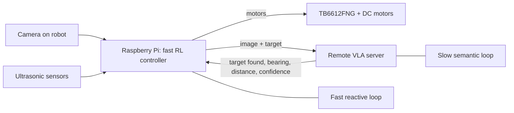

# Slow-Fast Hybrid VLA Navigation

Vision-language-action models can understand what a robot sees and what a user wants, but they are too slow to drive a low-cost robot safely by themselves. This project solves that gap by splitting the system into two parts: a slow semantic planner in the cloud/server and a fast local reinforcement-learning controller on the Raspberry Pi.

In practice, that means the robot can keep moving safely while waiting for delayed vision-language updates. For hiring teams, this is a full-stack robotics project that combines edge hardware, networking, computer vision, control, and RL. For research readers, it is a latency-aware hybrid control architecture with explicit freshness gating, a multi-mode state machine, and real-world evaluation on low-cost hardware.

## What This Project Does

- Runs a remote VLA server that analyzes camera frames and returns target position, distance, and confidence.
- Runs a fast Pi-side RL controller that turns those semantic hints into immediate motor commands.
- Uses ultrasonic sensors for local safety so the robot does not depend on slow inference for collision avoidance.
- Supports both the paper-oriented VLA pipeline and a lighter YOLO-based alternative for object detection.

## Why It Matters

Traditional VLA control is limited by latency. If the robot only reacts when the model responds, it becomes effectively blind during the inference window. This project addresses that frequency mismatch by separating slow reasoning from fast reflexes.

The result is a robot that can keep a stable local control loop on inexpensive hardware while still benefiting from high-level semantic perception when it is available.

## System Overview



The key design choice is that the Pi never waits on the model to stay safe. Local sensors and the RL policy continue to run even when the VLA update is stale or unavailable.

## Repository Layout

- [vla_server.py](vla_server.py): remote VLA server with image preprocessing, response parsing, and a web status page.
- [rpi_main.py](rpi_main.py): Pi-side controller that handles VLA communication, Q-learning, sensor fusion, and motor commands.
- [config.py](config.py): shared configuration for server address, target object, movement settings, and safety thresholds.
- [server/yolo_server.py](server/yolo_server.py): alternate GPU YOLO inference service for simpler object detection.
- [pi/hardware.py](pi/hardware.py): hardware abstraction for motors and ultrasonic sensors.
- [pi/standalone_rl.py](pi/standalone_rl.py): self-contained Pi controller using a YOLO server.
- [pi/hierarchical_rl_main.py](pi/hierarchical_rl_main.py): hierarchical control variant with layered safety, exploration, and goal-seeking.

## Quick Start

### 1) Start the remote vision server

On the laptop or desktop that will run the semantic model:

```bash
python vla_server.py
```

This exposes the VLA service on TCP port `9999` and a small web dashboard on port `5000`.

If you are using the YOLO fallback instead of the VLA server, run:

```bash
python server/yolo_server.py
```

That server listens on port `8000`.

### 2) Update the Pi configuration

Set the server address in [config.py](config.py) or [pi/config.ini](pi/config.ini) to the laptop IP address. The Pi code expects something like:

```ini
[server]
url = http://YOUR_LAPTOP_IP:8000
```

For the root VLA pipeline, use the TCP server settings in the Python files directly.

### 3) Run the robot controller on the Raspberry Pi

Primary VLA + RL flow:

```bash
sudo python3 rpi_main.py --server-ip YOUR_LAPTOP_IP --target bottle
```

Alternative YOLO-based Pi controller:

```bash
cd pi
python standalone_rl.py
```

## Hardware

- Raspberry Pi 4
- TB6612FNG motor driver
- 4x HC-SR04 ultrasonic sensors
- USB camera or Pi camera
- 4 DC motors
- Remote laptop or desktop for inference

The codebase includes hardware and simulation-friendly branches so you can still develop without the robot physically attached.

## Software Dependencies

Pi side:

- `RPi.GPIO`
- `opencv-python`
- `numpy`
- `requests`

Server side:

- `torch`
- `torchvision`
- `ultralytics`
- `flask`
- `opencv-python`
- `numpy`

See [pi/requirements.txt](pi/requirements.txt) and [server/requirements.txt](server/requirements.txt) for the full lists.

## How The Control Stack Works

The project uses a slow-fast split inspired by dual-process control:

- Slow system: a VLA model reads the scene and produces semantic guidance such as target bearing, approximate distance, and confidence.
- Fast system: a tabular Q-learning policy on the Pi converts sensor readings plus VLA hints into immediate motor commands.
- Safety layer: ultrasonic sensors override the action if an obstacle is too close.

The important idea is that latency is treated as a state variable, not just a deployment nuisance. That makes the policy aware of how stale the last VLA update is and how much it should trust it.

## Research Summary

This project is based on the paper idea that conventional VLA control is not stable on low-cost robots because the inference frequency is too low for closed-loop motion. The proposed solution is a hybrid architecture with separate semantic and reflexive pathways:

1. System 2 slow path: remote VLA reasoning produces high-level navigation guidance.
2. System 1 fast path: on-device RL generates real-time motor commands.
3. Latency awareness: the state includes a freshness feature `tau`, and the reward gates semantic credit as perception becomes stale.
4. Mode switching: the controller transitions between navigation, search, and exploration based on target visibility and update age.

### State Representation

The paper defines the robot state as a discretized tuple of sensor state, VLA bearing, VLA distance, confidence, mode, and latency. In code, this is implemented as a compact tabular state so learning remains tractable on edge hardware.

### Reward Design

The reward function balances:

- step penalty
- obstacle avoidance
- movement efficiency
- semantic progress
- goal completion

The freshness gate down-weights semantic reward when the VLA update is old, which prevents the policy from over-trusting stale perception.

### Reported Evaluation

The paper reports 65 randomized real-world trials on the task “find and approach a green plant object.” The hybrid system outperformed the baselines in success rate and collision reduction, with the best reported hybrid result at:

- Success rate: 69.2%
- Collision rate: 4.0%
- SPL: 0.58

Compared with the dual-system baseline without latency awareness, the latency-aware version improved success and reduced collisions, which supports the main thesis that freshness-aware control matters.

## Main Files To Read First

If you want the shortest path into the code, start with these files in order:

1. [config.py](config.py)
2. [vla_server.py](vla_server.py)
3. [rpi_main.py](rpi_main.py)
4. [pi/hardware.py](pi/hardware.py)
5. [server/yolo_server.py](server/yolo_server.py)

## Notes

- The repo contains multiple iterations of the controller, including a more experimental hierarchical version under [pi/hierarchical_rl_main.py](pi/hierarchical_rl_main.py).
- Some paths are designed for the full paper architecture, while others are practical fallbacks for simpler deployments.
- If you want to present this in an interview, the strongest story is: “I built a robot control stack that stays safe and responsive despite slow multimodal inference by separating semantic reasoning from real-time control.”
